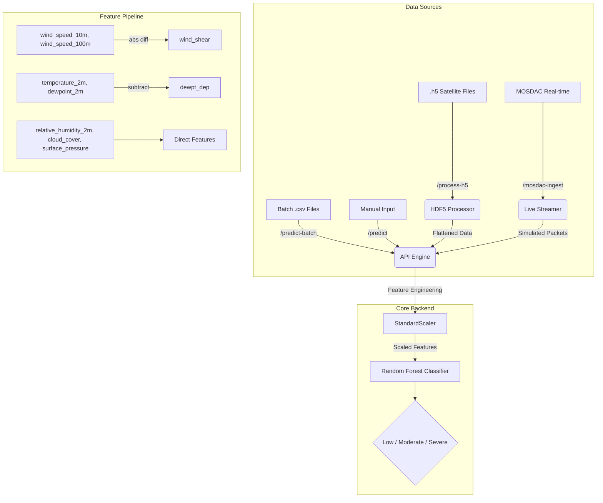

# Turbulence Insight: Cloud-Based Aviation Safety System
### Advanced Turbulence Prediction using Satellite Data Ingestion and Machine Learning


---

## 1. The Research Gap & Motivation

Turbulence remains one of the leading causes of non-fatal injuries in commercial aviation and significant operational costs due to rerouting and structural maintenance. 

**Traditional methods face three primary gaps:**
1.  **Vertical Resolution Gap**: Standard meteorological models often lack the fine-grained vertical resolution (e.g., at the 100m vs 10m levels) necessary to calculate precise wind shear in real-time.
2.  **Ingestion Bottleneck**: Raw satellite data from providers like **MOSDAC (INSAT-3D/3DR)** is delivered in complex HDF5 formats. Most existing systems require asynchronous, offline processing before any predictive analysis can occur.
3.  **Visualization Gap**: There is a lack of accessible, unified dashboards that can simultaneously handle single-point analysis, bulk historical verification, and real-time satellite streaming.

**Turbulence Insight** bridges these gaps by providing an end-to-end pipeline that converts raw satellite telemetry into actionable aviation risk intelligence using high-performance Machine Learning.

---

## 2. Core Functionalities

The system features a state-of-the-art **Interactive Dashboard** (Glassmorphism design) with four specialized analytical pathways:

### A. Instant Predict
*   **Purpose**: Real-time risk assessment for a specific flight coordinate.
*   **Function**: Accepts atmospheric inputs (Temperature, Dewpoint, Surface Pressure, Wind Speeds) and returns a categorical risk level (**Low, Moderate, Severe**) with a confidence score.

### B. Batch CSV Processing
*   **Purpose**: Bulk analysis for post-flight verification or regional mapping.
*   **Function**: Processes datasets containing thousands of records instantly. It provides a **Global Risk Profile** logic, calculating the percentage distribution of turbulence risks across the entire dataset.

### C. Raw HDF5 Data Converter & Analyzer
*   **Purpose**: Native ingestion of satellite-grade telemetry.
*   **Function**: Bypasses manual preprocessing by allowing users to upload `.h5` files directly. The system extracts geospatial metadata, flattens the arrays into ML-ready formats, and generates an immediate **Turbulence Intensity Profile**.

### D. Live MOSDAC Ingestion (MOSDAC-X)
*   **Purpose**: Real-time forecasting and situational awareness.
*   **Function**: Connects to the MOSDAC API skeleton to fetch live product metadata. It features a **scrolling data feed** and a **24-hour predictive forecast** trend, projecting future risks based on current atmospheric trends.

---

## 3. Technical Implementation & Features

### System Architecture



### Machine Learning Engine
*   **Model**: Random Forest Classifier (300 estimators, balanced class weights).
*   **Training**: Multi-location ERA5 data (5 Indian airports, 6 months) with **5-fold stratified cross-validation**.
*   **Feature Engineering**: Automatically derives critical indicators:
    *   **Wind Shear**: `|wind_speed_100m − wind_speed_10m|`
    *   **Dewpoint Depression**: `temperature_2m − dewpoint_2m`
*   **Labeling**: Physics-based Turbulence Potential Index (TPI):
    ```
    TPI = 0.40 × wind_shear + 0.25 × (100 − humidity) + 0.20 × cloud_cover + 0.15 × dewpt_dep
    ```
    Thresholds: Low (TPI < 12), Moderate (12–28), Severe (≥ 28).
*   **Input Validation**: Range checks on all meteorological features with clear warnings.

### The Backend Architecture
*   **API**: Flask-based RESTful service optimized for high-concurrency with Gunicorn.
*   **Containerization**: Fully Dockerized for seamless movement between local development and Cloud environments.

---

## 4. Project Structure

```
├── api/                          # Flask REST API (production)
│   ├── app.py                    # Main application & endpoints
│   ├── mosdac_client.py          # MOSDAC satellite data client
│   ├── predict.py                # CLI prediction utility
│   └── templates/
│       └── index.html            # Dashboard UI
├── training/                     # Model training pipeline
│   ├── train_model.py            # RF model training script
│   └── utils.py                  # Feature engineering & ERA5 data fetch
├── data_pipeline/                # Satellite data ingestion
│   ├── read_mosdac.py            # HDF5 batch reader
│   ├── read_mosdac_stream.py     # Streaming HDF5 reader
│   ├── process_mosdac_perfile.py # Per-file HDF5 processor
│   └── simulate_stream.py       # API stream simulation
├── tests/                        # Unit test suite
│   ├── test_api.py               # API endpoint & validation tests
│   └── test_training.py          # Feature engineering tests
├── model_artifacts/              # Trained model files (.gitignored)
├── Dockerfile                    # Production container build
├── .dockerignore
├── .gitignore
├── requirements.txt
├── README.md
├── DEPLOYMENT.md
└── DOCUMENTATION.md
```

---

## 5. Setup & Installation

### Option A: Using Docker (Recommended)
```bash
# Build the image
docker build -t turbulence-api .

# Run the container (Access at http://localhost:8080)
docker run -d -p 8080:8080 --name turbulence-api-container turbulence-api
```

### Option B: Manual Setup
1.  **Install dependencies**:
    ```bash
    pip install -r requirements.txt
    ```
2.  **Generate Model Artifacts**:
    ```bash
    cd training && python3 train_model.py && cd ..
    ```
3.  **Start Server**:
    ```bash
    gunicorn -w 4 -b 0.0.0.0:8080 api.app:app
    ```

---

## 6. API Endpoints Reference

| Endpoint | Method | Description |
| :--- | :--- | :--- |
| `/predict` | POST | Single point prediction. |
| `/predict-batch` | POST | Bulk CSV prediction + Global Risk Profile. |
| `/process-h5` | POST | Raw HDF5 conversion + Severity Analysis. |
| `/mosdac-ingest` | POST | Continuous live satellite data ingestion. |
| `/health` | GET | System health and model availability check. |

---

## 7. Testing

The project includes a comprehensive test suite (24 tests) covering API endpoints, input validation, and training utilities.

```bash
# Install test dependencies
pip install pytest

# Run all tests
pytest tests/ -v
```

| Test Module | Coverage |
| :--- | :--- |
| `test_api.py` | Health, dashboard, validation, prediction (single/multi/error), feature engineering |
| `test_training.py` | Feature columns, label generation, NaN handling, data integrity |

---

## 8. Future Roadmap
*   **Cloud Deployment**: Migration to AWS ECS / GCP Cloud Run with auto-scaling and S3-based artifact storage.
*   **Dynamic GIS Overlay**: Integrating mapping libraries to visualize results over geographic flight paths.
*   **Deep Learning (LSTM)**: Incorporating temporal sequences for improved forecasting accuracy.
*   **Real MOSDAC Integration**: Replacing mock client with authenticated MOSDAC API access.
